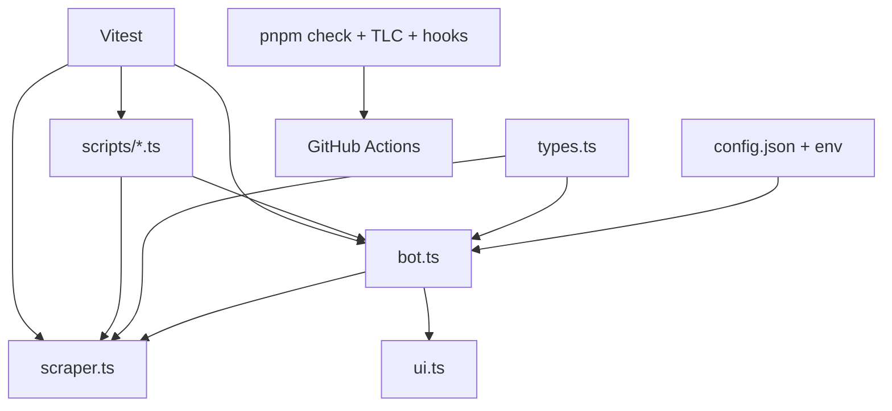

# Flightbot TypeScript and Agent-Harness Migration Design

**Spec**: `.specs/features/harness-typescript-migration/spec.md`
**Status**: Approved

## Architecture Overview

The application remains an uncompiled ESM-style script system. `tsx` loads explicit `.ts` entrypoints, `tsc --noEmit` owns static correctness, and Vitest imports modules without triggering scheduling or external calls. Operational shells, Docker, workflows, CI, hooks, and agent guidance all invoke the same TypeScript sources.



## Code Reuse Analysis

| Existing component | Location | How it is reused |
| --- | --- | --- |
| Alert/run orchestration | root bot runtime (legacy source removed) | Type without changing branches or persistence semantics. |
| Scrape pipeline | root scraper runtime (legacy source removed) | Preserve exports, selectors, prompt, delays, and post-extraction filters. |
| Terminal semantics | root terminal helpers (legacy source removed) | Preserve public formatters, glyph behavior, ANSI policy, and non-TTY logs. |
| Operational CLI contracts | `scripts/` | Split pure/testable functions from direct-entry wrappers. |
| TLC validators | `.agents/skills/tlc-spec-driven/scripts/*.py` | Port algorithms and exact observable contracts before deleting each predecessor. |

## Components and Interfaces

### Shared types

- **Location**: `types.ts`
- **Exports**: `Route`, `ConfigFile`, `RuntimeConfig`, `Flight`, `FlightExtractionResult`, `FilterOptions`, `PriceState`, `PricesFile`, `AlertType`, `RunOutcome`.
- **Rule**: CLI/status/smoke internal records stay local to their modules.

### Runtime orchestration

- **Location**: `bot.ts`
- **Exports**: `loadConfig`, `dateVariants`, `evaluateAlert`, `run`, `runWithLock`, `main`.
- **Boundary**: A direct-entry guard alone invokes `main`; imports never schedule work.
- **Injections**: filesystem, clock/timers, scraper, Telegram, logging, and lock operations where tests require isolation.

### Scrape pipeline

- **Location**: `scraper.ts`
- **Exports**: the existing five public functions.
- **Boundary**: Browser and Anthropic clients remain injectable/mockable; content narrows through a `type === "text"` block and throws explicitly if missing.

### Operational CLIs

- **Locations**: `scripts/config-route.ts`, `scripts/lib/format-status.ts`, `scripts/test-scrape.ts`.
- **Interfaces**: Each exports argument parsing or a runner/formatter accepting argv, paths, captured input, clock, output adapters, and external dependencies as applicable.
- **Boundary**: Direct-entry wrappers retain present stdout, stderr, and exit behavior.

### TLC CLIs

- **Location**: `.agents/skills/tlc-spec-driven/scripts/*.ts`.
- **Interface**: Each exports its checker plus `main(argv): number | Promise<number>`.
- **Boundary**: Exit codes 0/1/2, stream routing, autodetection, filesystem mutations, Unicode normalization, and warning semantics match the Python versions.

### Harness and repository guardrails

- **Locations**: `scripts/check-harness-score.ts`, `.claude/hooks/`, `.agents/rules/`, `.agents/skills/`, `.claude/agents/`, `.github/workflows/`, `lefthook.yml`.
- **Boundary**: Harness parses pinned JSON and applies only the 70 percent threshold. Hooks use structured Claude decisions and remain independently fixture-tested.

## TypeScript Configuration

```json
{
  "target": "ES2022",
  "module": "ESNext",
  "moduleResolution": "Bundler",
  "lib": ["ES2022", "DOM"],
  "strict": true,
  "noEmit": true,
  "verbatimModuleSyntax": true,
  "allowImportingTsExtensions": true
}
```

## Parallel Integration Design

- The orchestrator creates up to three temporary worktrees from the current integrated SHA.
- A worker receives only its tasks, requirements, owned files, tests, gate, and base SHA; it cannot spawn subagents.
- Workers run tasks serially inside their branch and make one conventional commit per task.
- The orchestrator cherry-picks task commits in order, resolves only bounded integration conflicts, runs the wave gate, and removes worktrees.
- Compact worker reports include task IDs, commit hashes, passed-test counts, and deviations/blockers. Raw logs remain in worktrees.

## Error Handling Strategy

| Scenario | Handling | Impact |
| --- | --- | --- |
| Config/secret missing | Preserve current thrown error and exit path. | Operator sees compatible diagnostic. |
| Claude content lacks text | Throw an explicit extraction response error. | Scrape run fails clearly without unsafe coercion. |
| TLC target absent/ambiguous | Preserve exit 2 and diagnostic stream. | Agent must specify a valid feature/path. |
| Hook input malformed | Deny or safely no-op according to hook role; never authorize destructive input. | Claude receives a stable structured response. |
| Formatting/lint repair fails | Post-edit hook exits successfully after best effort. | Editing is not blocked; normal gates still report defects. |
| Harness below threshold | Exit non-zero with score/threshold diagnostic. | Local/CI integration stops. |

## Risks & Concerns

| Concern | Location | Impact | Mitigation |
| --- | --- | --- | --- |
| Import-time bot side effects | `bot.ts` | Unit tests could schedule or call external systems. | Add an explicit direct-entry guard before tests import the module. |
| Large implicit runtime shapes | `bot.ts`, `scraper.ts` | Strict migration may hide unsafe casts. | Centralize domain types and narrow untrusted JSON/content. |
| Public log text is parsed | `bot.ts`, `scripts/lib/format-status.ts` | Cosmetic edits could break operations. | Snapshot focused public records and preserve non-TTY text. |
| Python parity is broad | TLC scripts | A straight rewrite could drift on stream/exit/mutation details. | Run both implementations against fixture corpora before deleting Python. |
| Parallel task file conflicts | `tasks.md` | Cherry-picks may conflict. | Each worker edits only its owned task blocks; orchestrator owns integration. |

## Requirement Mapping

| Requirements | Design area |
| --- | --- |
| HTM-01–06, HTM-13 | TypeScript runtime, shared types, modules, parity tests |
| HTM-07–10 | Hooks, rules, skills, diagnostic agent |
| HTM-11–12 | CI, package gates, pinned harness sensor |
| HTM-14 | Smoke runner safety boundary |
| HTM-15 | Independent mutation-based verifier |
